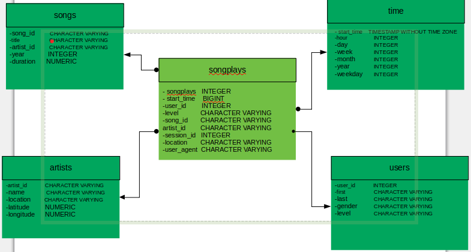

# Data Modeling in PostgreSQL
This project centers on building an ETL (Extract, Transform and Load) data pipeline in PostgreSQL RDBM.
The aim of the project is to simplify quering of data collected by a music streaming company in their app directory  JSON logs and another JSON directory containing some metadata. 
In the project a star schema consisting of a fact table and four dimensional tables is developed.
The fact table is called songplays while songs, users, artists and time  tables are the dimensional tables. 
The fact table is called songplays table while songs, users, artists and time  tables are the dimensional tables. The songplays table which shows the playing songs consists of the following fields: songplay_id, start_time, user_id, level, song_id, artist_id, session_id, location and user_agent. The songs table is made up of song_id, title, artist_id, year, duration fields. The table shows the title, year of release and durations of each songs in minutes. The artists table illustrates the id, name, location with latitudes and longitudes of the artists. The last but not the least, is the time table that gives specific timelines of the songs in hour, day, week, month, year and weekday. 
The star schema is shown in the figure below with the fields as well as their data types of each table. The links between the tables are evidently deducible and apparent.  



## Project Steps
1. The tables are created in a file called sql_queries.py using SQL CREATE statements. DROP statements precedes the CREATE statements to drop the tables if they already exist. DROP statements become particularly useful when the code is to be rerun in which case the tables already exist.

1. A test file "test.ipynb" is created and run to confirm the correctness of table creations with the right columns.

1. ETL processes are developed in the etl.ipynb file to extract and tranform some data from the given directories and load them into the tables created in step 1. test.ipynb is again used to check the correctness of the ETL operations. Thereafter, create_tables.py is developed to be run after each run of sql_queries.py followed by etl.ipynb followed and then test.ipynb.

1. Finally, etl.py file is where ETL pipeline processing is carried out on the entire datasets. The file includes four functions, namely:
    * process_song_file: This accepts two inputs, cursor and filepath to extract songs and artists tables from the song_data folder.
    * process_log_file: It also uses two arguments, cursor and filepath to extract  data for users, time and songplays tables from the log_data directory.
    * process_data function: This function accepts four inputs, namely: cursor, connection to the database, filepath and another function. It performs insertion operations to populate the tables.
    * main function: This defines all the argument/inputs variables and does the actual work of extraction, transformation and loading of the data.

## The order and methods of running the files are as follows:
<<<<<<< HEAD
   
1.  python3 sql_queries.py
1.  python3 create_tables.py
1.  python3 etl.py or run the etl.ipynb
1.  Run test.ipynb in Ipython
                            

||||||| merged common ancestors
    ```
    . python3 sql_queries.py
    . python3 create_tables.py
    . python3 etl.py or run the etl.ipynb
    . run test.ipynb in Ipython
                            ```

=======
    `
    . python3 sql_queries.py
    . python3 create_tables.py
    . python3 etl.py or run the etl.ipynb
    . run test.ipynb in Ipython
                            `
>>>>>>> 4479ac769f10db36a231400439f13e6e874a4a1a
## Credits
This project is a partial requirement for the completion of Udacity Data Engineering Nanodegree program. Hence, it is designed to meet Udacity project rubrics. [](www.udacity.com/)

## Software Packages
* Python2 or Python3
* PostgreSQL
* psycopg2 (a python driver for postgresql)

## Some Results From the analysis:
The following were deduced from the datasets by quering the tables after the ETL procecesses' completion:
* The songplays table has 6820 rows of data.
* The users table has 96 rows of data.
* The songs table has 71 rows of data.
* The artist table has 69 rows of data.
* The time table has 6813 rows of data.
* Of the 96 users, 55 are females while 41 are males.
* 5591 out of the songs played are paid whereas 1229 are played under free subscription.
* 14 out of the 55 female users are under paid subscription. 
* Only 6 out of the 41 male users are under paid subscription.
